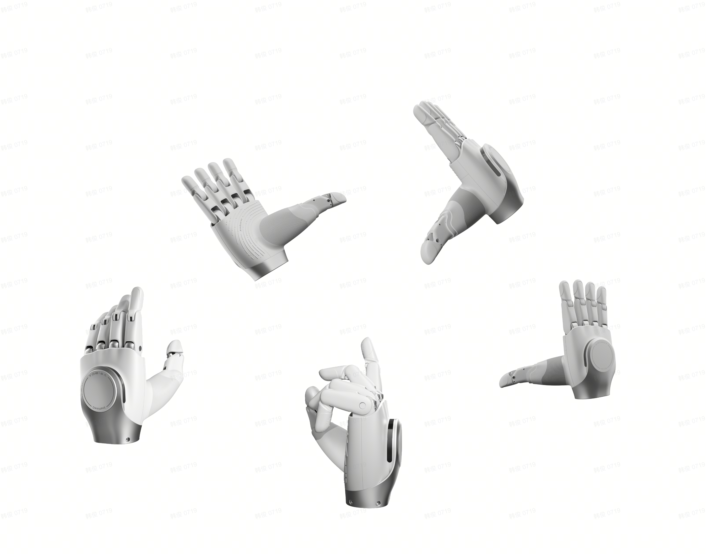

[English](README.md) | 中文

# OmniHand 2025 SDK

## 概述

OmniHand 2025 是一款 10 自由度的专业级灵巧手。



## 开始

### 系统要求

#### 硬件要求

- ZLG USBCANFD 系列 （推荐 USBCANFD-100U-mini/USBCANFD-100U）

#### 软件要求

- 操作系统：Ubuntu 22.04 (x86_64)
- 编译器：gcc 11.4 或更高版本
- 构建工具：CMake 3.16 或更高版本
- Python：3.10 或更高版本

### 安装

可以选择源码编译安装或者预编译包安装。

#### 源码编译安装

项目根目录下执行以下命令：

```bash
  ./build.sh -DCMAKE_BUILD_TYPE=Release \
             -DCMAKE_INSTALL_PREFIX=./build/install \
             -DBUILD_PYTHON_BINDING=ON \
             -DBUILD_CPP_EXAMPLES=OFF \
```

DBUILD_PYTHON_BINDING 选项用于构建 Python 绑定模块，DBUILD_CPP_EXAMPLES 选项用于构建 C++ 示例代码。

#### 预编译包安装

##### Python whl 包安装

```bash
# 从GitHub下载对应版本的python whl包
pip install ./omnihand_2025_py-0.8.0-cp310-cp310-linux_x86_64.whl
```

## 灵巧手电机索引

OmniHand Pro 2025 共 10 个自由度，索引从 1 到 12， 各索引对应的控制电机如下图所示：


## 运行示例

```bash
cd python/example

python3 ./demo_gestures_ok.py
```

## 目录结构

````bash
```bash
├── thirdParty              # 第三方依赖库
├── src                     # C++核心源代码
│   ├── proto.h
│   ├── export_symbols.h
│   ├── CMakeLists.txt
│   ├── can_bus_device
│   ├── c_agibot_hand.h
│   └── c_agibot_hand.cc
├── scripts                 # 脚本工具目录
│   └── setup.sh
├── python                  # Python绑定模块(基于C++源码生成的Python接口)
├── examples                # C++ 示例代码
├── document                # 文档目录
├── CMakeLists.txt          # 主CMake配置文件
├── cmake                   # CMake模块目录
└── build.sh                # 编译构建脚本
````

## API 介绍

详细 API 使用说明请参考以下链接：

- [OmniHand 2025 SDK C++ API 文档](document/API_CPP.md)
- [OmniHand 2025 SDK Python API 文档](document/API_PYTHON.md)

## 常见问题

### Q1: 启动程序发现无法和手进行通信？

**A:** 首先需要确保正确安装驱动，详情参见[ZLG 驱动安装说明](https://manual.zlg.cn/web/#/42/1710:~:text=%23sudo%20chmod%20666%20/dev/bus/usb/xxx/yyy)，确保手电源已连接，且 USB 端接入电脑后，执行以下指令：

```shell
lsusb

sudo chmod 666 /dev/bus/usb/xxx/yyy
```

### Q2: 源码编译在 python 打包环节报错？

**A:** 检查如下依赖是否安装：

```shell
sudo apt install python3.10-dev

pip3 install build setuptools wheel
```

## 版权声明

Copyright (c) 2025 Agibot Co., Ltd. OmniHand 2025 SDK is licensed under Mulan PSL v2.

---

_本文档版本：v0.8.0_  
_最后更新：2025-8_
