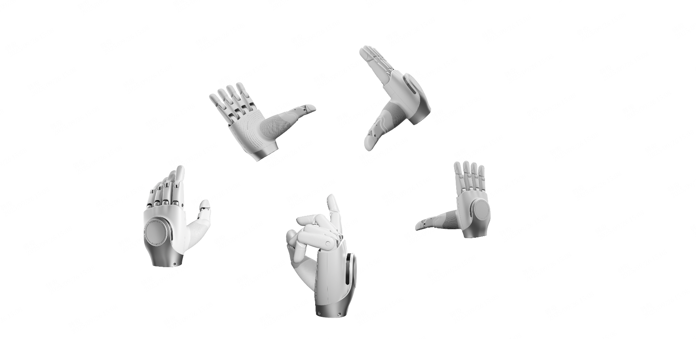
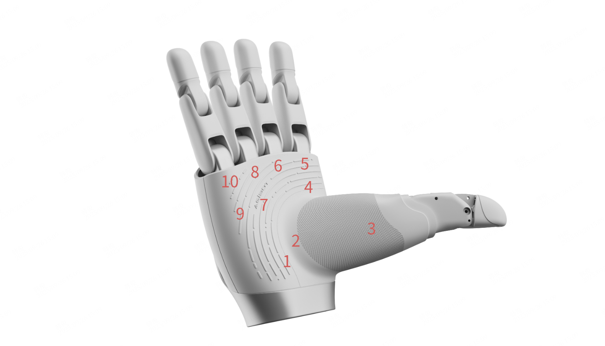

[English](README.md) | 中文

# OmniHand 灵动款 2025 SDK

## 概述

OmniHand 灵动款 2025 是一款紧凑型高自由度交互灵巧手，具有`10主动+6被动自由度`，重量仅 500 g，采用 CANFD/RS485 通信接口，配备`400+ 触觉点位和0.1 N 阵列分辨率，最大指尖力达5 N`，适用于各类人形机器人和机械臂，其小巧轻便的设计和丰富的触觉交互功能使其在交互服务、科研教育和轻作业等场景中具有广泛应用价值。

为方便用户快速开发和应用，我们提供配套的 OmniHand 灵动款 2025 SDK 开发包，支持 Python 和 C++双语言 API 接口，快速实现灵巧手的控制和数据采集等功能。



## 开始

### 系统要求

#### 硬件要求

支持 CANFD/RS485 两种通信接口

- CANFD： 目前支持 ZLG USBCANFD 系列 （推荐 USBCANFD-100U-mini/USBCANFD-100U/USBCANFD-200U）
- RS485：

#### 软件要求

- 操作系统：Ubuntu 22.04 (x86_64)
- 编译器：gcc 11.4 或更高版本
- 构建工具：CMake 3.16 或更高版本
- Python：3.10 或更高版本

### 安装

可以选择源码编译安装或者预编译包安装。

#### 源码编译安装

项目根目录下执行以下命令：

```bash
  ./build.sh -DCMAKE_BUILD_TYPE=Release \
             -DCMAKE_INSTALL_PREFIX=./build/install \
             -DBUILD_PYTHON_BINDING=ON \
             -DBUILD_CPP_EXAMPLES=OFF \
```

DBUILD_PYTHON_BINDING 选项用于构建 Python 绑定模块，DBUILD_CPP_EXAMPLES 选项用于构建 C++ 示例代码。

#### 预编译包安装

##### Python whl 包安装

```bash
# 从GitHub下载对应版本的python whl包
pip install ./omnihand_2025_py-0.8.0-cp310-cp310-linux_x86_64.whl
```

## 灵巧手电机索引

OmniHand 2025 共 10 个自由度，索引从 1 到 10， 各索引对应的控制电机如下图所示：



## 运行示例

```bash
cd python/example

python3 ./demo_set_motor.py
```

## 目录结构

```bash
.
├── assets                      # 模型文件
├── build.sh                    # 编译构建脚本
├── cmake                       # CMake模块目录
├── CMakeLists.txt              # 主CMake配置文件
├── document                    # 文档目录
├── examples                    # C++ 示例代码
├── python                      # Python绑定模块(基于C++源码生成的Python接口)
├── src
│   ├── c_agibot_hand_base.cc
│   ├── c_agibot_hand_base.h
│   ├── can_bus_device
│   │   ├── socket_can
│   │   └── zlg_usb_canfd
│   ├── CMakeLists.txt
│   ├── export_symbols.h
│   ├── implementation
│   │   ├── c_agibot_hand_can
│   │   └── c_agibot_hand_rs
│   ├── kinematics_solver
│   ├── proto.h
│   └── rs_485_device
└── thirdParty                  # 第三方依赖库
```

## API 介绍

详细 API 使用说明请参考以下链接：

- [OmniHand 2025 SDK C++ API 文档](document/zh_cn/API_CPP.md)
- [OmniHand 2025 SDK Python API 文档](document/API_PYTHON.md)

## 常见问题

### Q1: 使用 can 驱动，发现启动程序发现无法和手进行通信？

**A:** 首先需要确保正确安装驱动，详情参见[ZLG 驱动安装说明](https://manual.zlg.cn/web/#/42/1710:~:text=%23sudo%20chmod%20666%20/dev/bus/usb/xxx/yyy)，确保手电源已连接，且 USB 端接入电脑后，执行以下指令：

```shell
lsusb

sudo chmod 666 /dev/bus/usb/xxx/yyy
```

### Q2: 使用串口驱动，发现启动程序发现无法和手进行通信？

**A:** 需要给对应串口端口开读写权限，执行以下指令：

```shell
ll /dev/ttyUSB*

sudo chmod a+rw /dev/ttyUSB0
```

### Q3: 源码编译在 python 打包环节报错？

**A:** 检查如下依赖是否安装：

```shell
sudo apt install python3.10-dev

pip3 install build setuptools wheel
```

## 版权声明

Copyright (c) 2025 Agibot Co., Ltd. OmniHand 2025 SDK is licensed under Mulan PSL v2.

---

_本文档版本：v0.8.0_  
_最后更新：2025-9_
