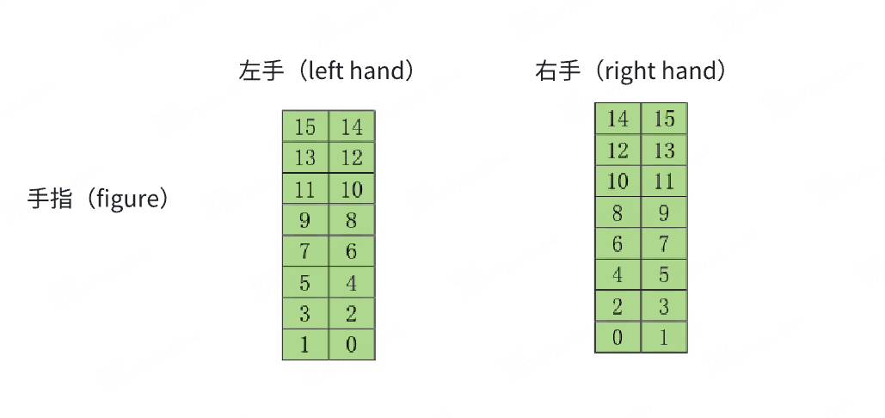

# OmniHand Flexible 2025 SDK C++ API

## Enums

### EFinger

```cpp
enum class EFinger : unsigned char {
    eThumb   = 0x01,    // Thumb
    eIndex   = 0x02,    // Index finger
    eMiddle  = 0x03,    // Middle finger
    eRing    = 0x04,    // Ring finger
    eLittle  = 0x05,    // Little (pinky) finger
    ePalm    = 0x06,    // Palm
    eDorsum  = 0x07,    // Dorsum (back of hand)
    eUnknown = 0xff     // Unknown
};
```

### EControlMode

```cpp
enum class EControlMode : unsigned char {
  ePosi           = 0,    // Position mode
  eServo          = 1,    // Servo mode
  eVelo           = 2,    // Velocity mode
  eTorque         = 3,    // Torque mode
  ePosiTorque     = 4,    // Position-Torque mode (Not yet supported)
  eVeloTorque     = 5,    // Velocity-Torque mode (Not yet supported)
  ePosiVeloTorque = 6,    // Position-Velocity-Torque mode (Not yet supported)
  eUnknown        = 10    // Unknown mode
};
```

### EMsgType

```cpp
enum class EMsgType : unsigned char {
    eVendorInfo        = 0x01,    // Vendor information
    eDeviceInfo        = 0x02,    // Device information
    eCurrentThreshold  = 0x03,    // Current threshold
    eTactileSensor     = 0x05,    // Tactile sensor
    eCtrlMode          = 0x10,    // Control mode
    eTorqueCtrl        = 0x11,    // Torque control
    eVeloCtrl          = 0x10,    // Velocity control
    ePosiCtrl          = 0x13,    // Position control
    eMixCtrl           = 0x14,    // Mixed control
    eErrorReport       = 0x20,    // Error report
    eTemperatureReport = 0x21,    // Temperature report
    eCurrentReport     = 0x22,    // Current report
};
```

## Data Structures

### VendorInfo

```cpp
struct VendorInfo {
    std::string product_model;    // Product model
    std::string product_seq_num;  // Product serial number
    Version hardware_version;     // Hardware version
    Version software_version;     // Software version
    int16_t voltage;              // Supply voltage (mV)
    uint8_t dof;                  // Degrees of Freedom

    std::string toString() const;
};
```

### DeviceInfo

```cpp
struct AGIBOT_EXPORT CommuParams {
  unsigned char bitrate_;
  unsigned char sample_point_;
  unsigned char dbitrate_;
  unsigned char dsample_point_;
};

struct AGIBOT_EXPORT DeviceInfo {
  unsigned char deviceId;   // Device ID
  CommuParams commuParams;  // Communication parameters
};
```

### JointMotorErrorReport

```cpp
struct JointMotorErrorReport {
    unsigned char stalled_      : 1; // Stall flag
    unsigned char overheat_     : 1; // Overheat flag
    unsigned char over_current_ : 1; // Overcurrent flag
    unsigned char motor_except_ : 1; // Motor exception flag
    unsigned char commu_except_ : 1; // Communication exception flag
    unsigned char res1_         : 3; // Reserved bits
    unsigned char res2_;             // Reserved byte
};
```

### MixCtrl (Mixed Control Structure)

```cpp
struct MixCtrl {
    unsigned char joint_index_ : 5;      // Joint index (1-10)
    unsigned char ctrl_mode_   : 3;      // Control mode
    std::optional<short> tgt_posi_;      // Target position
    std::optional<short> tgt_velo_;      // Target velocity
    std::optional<short> tgt_torque_;    // Target torque
};
```

### CanId (CAN Message ID Structure)

```cpp
struct CanId {
    unsigned char device_id_  : 7;    // Device ID
    unsigned char rw_flag_    : 1;    // Read/Write flag
    unsigned char product_id_ : 7;    // Product ID
    unsigned char res1        : 1;    // Reserved bit
    unsigned char msg_type_;          // Message type
    unsigned char msg_id_;            // Message ID
};
```

### Version

```cpp
struct Version {
    unsigned char major_;    // Major version
    unsigned char minor_;    // Minor version
    unsigned char patch_;    // Patch version
    unsigned char res_;      // Reserved byte
};
```

### CommuParams (Communication Parameters Structure)

```cpp
struct CommuParams {
    unsigned char bitrate_;       // Bitrate
    unsigned char sample_point_;  // Sample point
    unsigned char dbitrate_;      // Data bitrate
    unsigned char dsample_point_; // Data sample point
};
```

## AgibotHandO10 Class and Function Interface

### Create a Hand Instance

```cpp
/**
 * @brief Creates a dexterous hand instance.
 * @param device_id The device ID, defaults to 1.
 * @param hand_type The hand type (left/right), defaults to left hand.
 * @return A shared pointer to the dexterous hand object.
 */
static std::shared_ptr<AgibotHandO10> CreateHand(
    unsigned char device_id = 1,
    unsigned char canfd_id = 0,
    EHandType hand_type = EHandType::eLeft);
```

### Constructor

```cpp
/**
 * @brief Constructor.
 * @param device_id The device ID, defaults to 1.
 */
explicit AgibotHandO10();
```

### Device Information

```cpp
/**
 * @brief Gets vendor information.
 * @return A long string containing vendor info, including product model, serial number, hardware version, software version, etc.
 */
std::string GetVendorInfo();

/**
 * @brief Gets device information.
 * @return A long string containing the device's operational status information.
 * @note This interface is not supported for serial port communication.
 */
std::string GetDeviceInfo();

/**
 * @brief Sets the device ID.
 * @param device_id The device ID.
 * @note This interface is not supported for serial port communication.
 */
void SetDeviceId(unsigned char device_id);
```

### Motor Position Control

```cpp
/**
 * @brief Sets the position of a single joint motor.
 * @param joint_motor_index The index of the joint motor (1-10).
 * @param posi The motor position, range: 0~2000.
 */
void SetJointMotorPosi(unsigned char joint_motor_index, short posi);

/**
 * @brief Gets the position of a single joint motor.
 * @param joint_motor_index The index of the joint motor (1-10).
 * @return The current position value. Returns -1 on failure.
 */
short GetJointMotorPosi(unsigned char joint_motor_index);

/**
 * @brief Sets the positions of all joint motors in batch.
 * @param vec_posi A vector of target positions for all joints, must have a length of 10.
 * @note Be sure to provide position data for all 10 joint motors.
 */
void SetAllJointMotorPosi(std::vector<short> vec_posi);

/**
 * @brief Gets the positions of all joint motors in batch.
 * @return A vector of the current positions of all joints, with a length of 10.
 */
std::vector<short> GetAllJointMotorPosi();
```

### Joint Angle Control

#### Joint Angle I/O Order (Right Hand)

| Index | Joint Name         | Min Angle (rad)      | Max Angle (rad)     | Min Angle (°) | Max Angle (°) | Velocity Limit (rad/s) |
| ----- | ------------------ | -------------------- | ------------------- | ------------- | ------------- | ---------------------- |
| 1     | R_thumb_roll_joint | -0.17453292519943295 | 0.8726646259971648  | -10           | 50            | 0.164                  |
| 2     | R_thumb_abad_joint | -1.7453292519943295  | 0                   | -100          | 0             | 0.164                  |
| 3     | R_thumb_mcp_joint  | 0                    | 0.8552113334772214  | 0             | 49            | 0.308                  |
| 4     | R_index_abad_joint | -0.20943951023931953 | 0                   | -12           | 0             | 0.164                  |
| 5     | R_index_pip_joint  | 0                    | 1.5707963267948966  | 0             | 90            | 0.308                  |
| 6     | R_middle_pip_joint | 0                    | 1.5707963267948966  | 0             | 90            | 0.308                  |
| 7     | R_ring_abad_joint  | 0                    | 0.17453292519943295 | 0             | 10            | 0.164                  |
| 8     | R_ring_pip_joint   | 0                    | 1.5707963267948966  | 0             | 90            | 0.308                  |
| 9     | R_pinky_abad_joint | 0                    | 0.17453292519943295 | 0             | 10            | 0.164                  |
| 10    | R_pinky_pip_joint  | 0                    | 1.5707963267948966  | 0             | 90            | 0.308                  |

#### Joint Angle I/O Order (Left Hand)

| Index | Joint Name         | Min Angle (rad)      | Max Angle (rad)     | Min Angle (°) | Max Angle (°) | Velocity Limit (rad/s) |
| ----- | ------------------ | -------------------- | ------------------- | ------------- | ------------- | ---------------------- |
| 1     | L_thumb_roll_joint | -0.8726646259971648  | 0.17453292519943295 | -50           | 10            | 0.164                  |
| 2     | L_thumb_abad_joint | 0                    | 1.7453292519943295  | 0             | 100           | 0.164                  |
| 3     | L_thumb_mcp_joint  | -0.8552113334772214  | 0                   | -49           | 0             | 0.308                  |
| 4     | L_index_abad_joint | 0                    | 0.20943951023931953 | 0             | 12            | 0.164                  |
| 5     | L_index_pip_joint  | 0                    | 1.5707963267948966  | 0             | 90            | 0.308                  |
| 6     | L_middle_pip_joint | 0                    | 1.5707963267948966  | 0             | 90            | 0.308                  |
| 7     | L_ring_abad_joint  | -0.17453292519943295 | 0                   | -10           | 0             | 0.164                  |
| 8     | L_ring_pip_joint   | 0                    | 1.5707963267948966  | 0             | 90            | 0.308                  |
| 9     | L_pinky_abad_joint | -0.17453292519943295 | 0                   | -10           | 0             | 0.164                  |
| 10    | L_pinky_pip_joint  | 0                    | 1.5707963267948966  | 0             | 90            | 0.308                  |

```cpp
/**
 * @brief Sets the angles of all active joints.
 * @param angles A vector of joint angles (in radians), must have a length of 10.
 * @note For specific order and limits, please refer to the assets model files.
 */
void SetAllActiveJointAngles(const std::vector<double>& angles);

/**
 * @brief Gets the angles of all active joints.
 * @return A vector of joint angles (in radians), with a length of 10.
 * @note For specific order and limits, please refer to the assets model files.
 */
std::vector<double> GetAllActiveJointAngles() const;

/**
 * @brief Gets the angles of all joints (both active and passive).
 * @return A vector of joint angles (in radians).
 * @note For specific order and limits, please refer to the assets model files.
 */
std::vector<double> GetAllJointAngles() const;
```

### Velocity Control

```cpp
/**
 * @brief Sets the velocity of a single joint motor.
 * @param joint_motor_index The index of the joint motor (1-10).
 * @param velo The target velocity value.
 * @note This interface is not supported for serial port communication.
 */
void SetJointMotorVelo(unsigned char joint_motor_index, short velo);

/**
 * @brief Gets the velocity of a single joint motor.
 * @param joint_motor_index The index of the joint motor (1-10).
 * @return The current velocity value. Returns -1 on failure.
 * @note This interface is not supported for serial port communication.
 */
short GetJointMotorVelo(unsigned char joint_motor_index);

/**
 * @brief Sets the velocities of all joint motors in batch.
 * @param vec_velo A vector of target velocities for all joints, must have a length of 10.
 */
void SetAllJointMotorVelo(std::vector<short> vec_velo);

/**
 * @brief Gets the velocities of all joint motors in batch.
 * @return A vector of the current velocities of all joints, with a length of 10.
 */
std::vector<short> GetAllJointMotorVelo();
```

### Sensor Data

```cpp
/**
 * @brief Gets the tactile sensor data for a specified finger.
 * @param eFinger The finger enum value.
 * @return A list of tactile sensor data. The length is 16 for a finger sensor, and 25 for the palm/dorsum sensor.
 */
std::vector<uint8_t> GetTactileSensorData(EFinger eFinger);
```

The 16 sensors on a finger are arranged as follows:



### Control Mode

```cpp
/**
 * @brief Sets the control mode of a single joint motor.
 * @param joint_motor_index The index of the joint motor (1-10).
 * @param mode The control mode enum value.
 */
void SetControlMode(unsigned char joint_motor_index, EControlMode mode);

/**
 * @brief Gets the control mode of a single joint motor.
 * @param joint_motor_index The index of the joint motor (1-10).
 * @return The current control mode.
 * @note This interface is not supported for serial port communication.
 */
EControlMode GetControlMode(unsigned char joint_motor_index);

/**
 * @brief Sets the control modes of all joint motors in batch.
 * @param vec_ctrl_mode A vector of control modes, must have a length of 10.
 * @note This interface is not supported for serial port communication.
 */
void SetAllControlMode(std::vector<unsigned char> vec_ctrl_mode);

/**
 * @brief Gets the control modes of all joint motors in batch.
 * @return A vector of control modes, with a length of 10.
 * @note This interface is not supported for serial port communication.
 */
std::vector<unsigned char> GetAllControlMode();
```

### Current Threshold Control

```cpp
/**
 * @brief Sets the current threshold of a single joint motor.
 * @param joint_motor_index The index of the joint motor (1-10).
 * @param current_threshold The current threshold value.
 * @note This interface is not supported for serial port communication.
 */
void SetCurrentThreshold(unsigned char joint_motor_index, short current_threshold);

/**
 * @brief Gets the current threshold of a single joint motor.
 * @param joint_motor_index The index of the joint motor (1-10).
 * @return The current threshold value. Returns -1 on failure.
 * @note This interface is not supported for serial port communication.
 */
short GetCurrentThreshold(unsigned char joint_motor_index);

/**
 * @brief Sets the current thresholds of all joint motors in batch.
 * @param vec_current_threshold A vector of current thresholds, must have a length of 10.
 * @note This interface is not supported for serial port communication.
 */
void SetAllCurrentThreshold(std::vector<short> vec_current_threshold);

/**
 * @brief Gets the current thresholds of all joint motors in batch.
 * @return A vector of current thresholds, with a length of 10.
 * @note This interface is not supported for serial port communication.
 */
std::vector<short> GetAllCurrentThreshold();
```

### Mixed Control

```cpp
/**
 * @brief Controls joint motors in mixed mode.
 * @param vec_mix_ctrl A vector of mixed control parameters.
 * @note This interface is not supported for serial port communication.
 */
void MixCtrlJointMotor(std::vector<MixCtrl> vec_mix_ctrl);
```

### Error Handling

```cpp
/**
 * @brief Gets the error report for a single joint motor.
 * @param joint_motor_index The index of the joint motor (1-10).
 * @return The error report structure.
 */
JointMotorErrorReport GetErrorReport(unsigned char joint_motor_index);

/**
 * @brief Gets the error reports for all joint motors.
 * @return A vector of error reports, with a length of 10.
 */
std::vector<JointMotorErrorReport> GetAllErrorReport();
```

### Temperature Monitoring

```cpp
/**
 * @brief Gets the temperature report for a single joint motor.
 * @note The reporting period must be set before querying.
 * @param joint_motor_index The index of the joint motor (1-10).
 * @return The current temperature value. Returns -1 on failure.
 */
unsigned short GetTemperatureReport(unsigned char joint_motor_index);

/**
 * @brief Gets the temperature reports for all joint motors.
 * @note The reporting period must be set before querying.
 * @return A vector of temperature values, with a length of 10.
 */
std::vector<unsigned short> GetAllTemperatureReport();
```

### Current Monitoring

```cpp
/**
 * @brief Gets the current report for a single joint motor.
 * @note The reporting period must be set before querying.
 * @param joint_motor_index The index of the joint motor (1-10).
 * @return The current value. Returns -1 on failure.
 */
short GetCurrentReport(unsigned char joint_motor_index);

/**
 * @brief Gets the current reports for all joint motors.
 * @note The reporting period must be set before querying.
 * @return A vector of current values, with a length of 10.
 */
std::vector<unsigned short> GetAllCurrentReport();
```

### Debugging Features

```cpp
/**
 * @brief Toggles the display of raw send/receive data details.
 * @param show Whether to show the data details.
 */
void ShowDataDetails(bool show) const;
```
